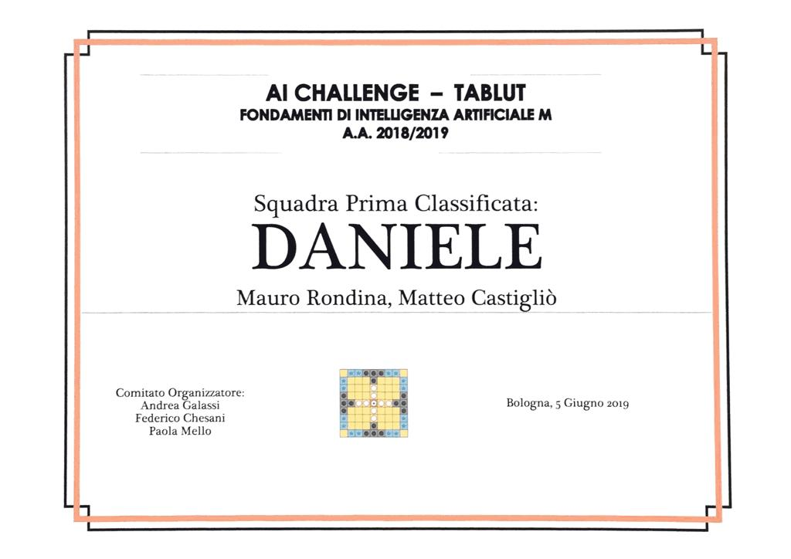

# Daniele

Project for Fundamentals of Artificial Intelligence course at the University of Bologna.
Tablut Player for 2018/2019 Tablut Challenge INF http://ai.unibo.it/games/boardgamecompetition/tablut#

# Description
Intelligent Tablut Player written in Java based on state exploration using MinMax. 

# Features 

* SingleThreaded MinMax with Iterative Deeping and AlphaBeta Pruning and partial ordering between iterations.
* Heuristic strongly based on playing around the King.

# Usage

The executables can be found in jars directory.
To play a game the server must be started first.

```[bash]
cd jars
java -jar Server.jar
```
Then launch Daniele selecting the role ( additional options can be used to select time to make a decision and verbose mode).

```[bash]
cd jars
java -jar Daniele.jar White/Black [Time] [verbose]
```

jars/server.jar and lib/TablutCompetion.jar are from https://github.com/AGalassi/TablutCompetition.


# Results

Daniele got first place in 2018/2019 edition of the challenge



By  Matteo Castigliò e Mauro Rondina.


***


***


